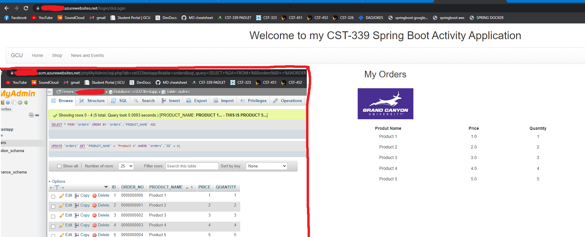

# 
# SpringBoot Lift N Shift
Michal A Uchmanowicz, Grand Canyon University, 2023

*Java, Springboot, Thymeleaf, Docker, AWS, Google Cloud, Azure, Heroku*

___

All Documentation may not be posted within this repository due to it being part of the Grand Canyon University Curriculum. Documentation and Details are available upon request. 

___

## Abstract

I created a springboot application and hosted it within several clouds: AWS, Google Cloud, Azure, and Heroku. The cloud hosted springboot Application features a home page and a "pseudo-login", allowing for any input which will take the user to an orders page. The user can see all orders which are retrieved from a MySQL database hosted by the same cloud host.

  

Springboot app running in AWS

  

Springboot app running in Google Cloud

  

Springboot app running in Azure

  

Springboot app running in Heroku, i was unable to get mysqlworkbench to connect as i was at maximum database connections.

